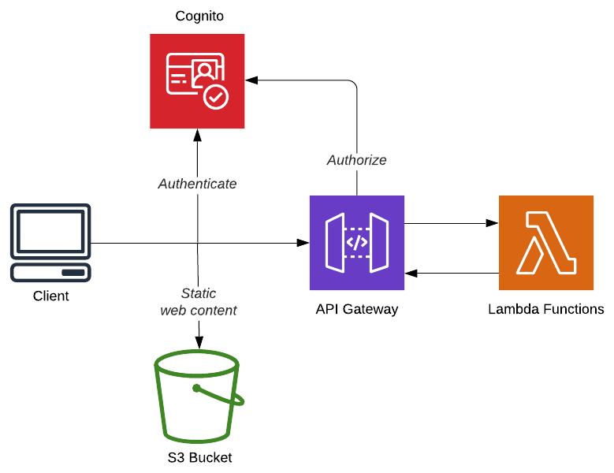

# Access Control with AWS Cognito
<figure>
  
  <figcaption></figcaption>
</figure>
Cognito is an services provided by Amazon for managing user profiles, tracking users sessions and, when combined with IAM roles, securing AWS resources. 

The Cloudbash application uses AWS Cognito for the following functionality:
- User Authentication (Sign up  & Sign in)
- Authorization of 
- Role based Authorization
- Identity Verification (by SMS)
- User Account Recovery (by email)


## Serverless Framework
**Cognito User Pool** - [source](https://github.com/BobvD/Cloudbash/blob/dev/src/Lambda/serverless/resources/CognitoUserPool.yml)
``` yaml
Type: AWS::Cognito::UserPool
Properties:
    UserPoolName: Cloudbash
``` 
**User Pool Client** - [source](https://github.com/BobvD/Cloudbash/blob/dev/src/Lambda/serverless/resources/CognitoUserPoolClient.yml)
``` yaml
Type: AWS::Cognito::UserPoolClient
Properties:
    ClientName: CloudbashWebApp
    GenerateSecret: false
    UserPoolId:
        Ref: CloudbashCognitoUserPool
```
## Client-side
### Implementing user sign up and login with AWS- Cognito and Amplify

[AWS Amplify](https://aws.amazon.com/amplify/) is an Javascript library that provides tools for developing serverless web applications using amazon web services. Amplify has [many features](https://docs.amplify.aws/) that will speed up your development. For this application we are using the Authentication API and Angular UI components for the user sign up and login flow.

The preferred way for using Cognito with AWS Amplify is to generate the *user pool* with the [Amplify CLI](https://github.com/aws-amplify/amplify-cli). But for this project we will be using a user pool that we have created with the Serverless Framework. The ID and region of the user pool need to be provided in the aws-exports.js file in the source folder of your project.

**Dependencies**
- [aws-amplify](https://www.npmjs.com/package/aws-amplify)
- [aws-amplify-angular](https://www.npmjs.com/package/aws-amplify-angular)
  
**app.module.ts** - [source](https://github.com/BobvD/Cloudbash/blob/dev/src/WebUI/src/app/app.module.ts)<br />
The AmplifyService is registered as an provider.
``` ts
import { AmplifyService, AmplifyModules } from 'aws-amplify-angular';
import Auth from '@aws-amplify/auth'; 

providers: [
    {
        provide: AmplifyService,
        useFactory:  () => {
        return AmplifyModules({
            Auth
        });
        }
    }
],
```
**authentication.service.ts** - [source](https://github.com/BobvD/Cloudbash/blob/dev/src/WebUI/src/app/shared/services/authentication.service.ts)<br />
The authentication service contains logic that will listen to auth changes from the amplify service. When a user is succesfully logged in, the user information is stored for use in the application. </br> The *getRole()* function provides a fast way for retrieving the role from the signed in user. 

<<< @/../src/WebUI/src/app/shared/services/authentication.service.ts

**auth-page.component.ts** - [source](https://github.com/BobvD/Cloudbash/blob/dev/src/WebUI/src/app/modules/auth/pages/auth-page/auth-page.component.html) <br />
The Amplify Authenticator component implements forms for user sign up, log in and account recovery.
``` ts
<amplify-authenticator></amplify-authenticator>
```

**auth.guard.ts** - [source](https://github.com/BobvD/Cloudbash/blob/dev/src/WebUI/src/app/shared/guards/auth.guard.ts) <br />
The AutGuard can be used to authorize users when they visit a specific page. When the user is not authenticated, or does not have the correct role, it will be redirected to the log-in page.

<<< @/../src/WebUI/src/app/shared/guards/auth.guard.ts

**jwt.interceptor.ts** - [source](https://github.com/BobvD/Cloudbash/blob/dev/src/WebUI/src/app/shared/helpers/jwt.interceptor.ts) <br />
The JWT Interceptor automatically adds an Authorization header with the JWT Token when a HTTP call is made.

<<< @/../src/WebUI/src/app/shared/helpers/jwt.interceptor.ts

**app-routing.module.ts** - [source]() <br />
Making use of the AuthGuard to secure routes. The example below makes sure that only authenticated users with the admin rule can visit the page on the /admin path.
``` ts
 {
    path: '/admin',
    component: AdminDashboardPageComponent,
    canActivate: [AuthGuard],
    data: { roles: [Role.Admin] }
},
```
## Server-side
### Securing REST Endpoints


## Further reading
- [AWS Cognito integration with lambda functions using the Serverless Framework](http://www.andyfrench.info/2018/10/aws-cognito-integration-with-lambda.html) <br /> - by Andy French