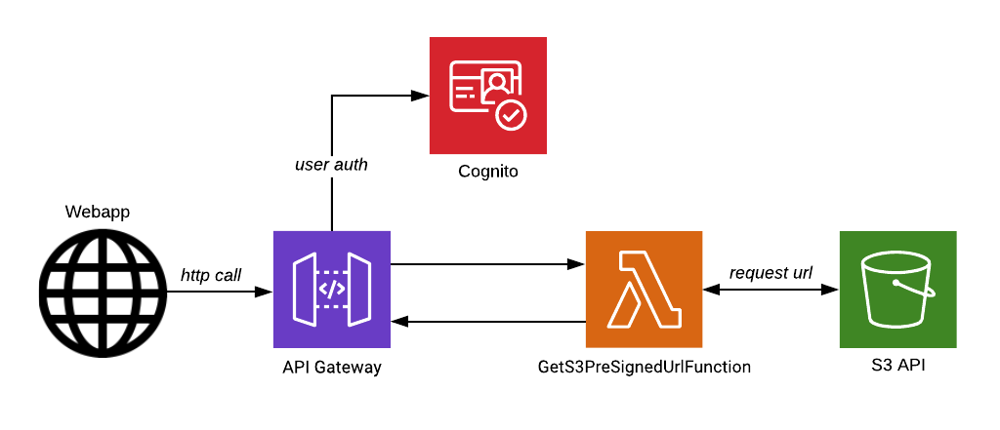

# Upload files to Amazon Simple Storage Service (S3) with Presigned Urls
<figure>
  
  <figcaption></figcaption>
</figure>
Presigned URLs can be used as a simple and secure way to upload (large) files to an S3 Bucket. The URL is generated using IAM credentials with permission to write to the bucket.  

The presigned URL has an expiration time, the upload needs to be started before this time, or it will be denied. You can use the URL only once. When generating the URL you also need to provide the target bucket and name of the object (key) you want to upload.

It is possible to manually generate Pre-signed URLs with the AWS CLI, but for our implementation we will be using the AWS SDK to generate urls when this is requested by an user of our angular application.

## Server-side code
**GetS3PreSignedUrlFunction.cs** - [source](https://github.com/BobvD/Cloudbash/blob/dev/src/Lambda/Functions/Files/GetS3PreSignedURLFunction.cs) <br />
The code for our Lambda Endpoint. It will return the Presigned URL on success or an error message on failure.
We use the [Mediator](https://github.com/jbogard/MediatR) pattern to decouple the presentation and application layer.
``` csharp
[LambdaSerializer(typeof(Amazon.Lambda.Serialization.Json.JsonSerializer))]
public async Task<APIGatewayProxyResponse> Run(APIGatewayProxyRequest request)
{           
    var requestModel = 
        JsonConvert.DeserializeObject<GetS3PreSignedUrlCommand>(request.Body);
    
    try
    {               
        var result = await Mediator.Send(requestModel);
        return new APIGatewayProxyResponse
        {
            Headers = GetCorsHeaders(),
            StatusCode = 201,
            Body = JsonConvert.SerializeObject(result)
        };
    }
    catch (Exception ex)
    {
        return new APIGatewayProxyResponse
        {
            Headers = GetCorsHeaders(),
            StatusCode = 400,
            Body = JsonConvert.SerializeObject(ex.Message)
        };
    }
}
```
**GetS3PreSignedUrlCommand.cs** - [source](https://github.com/BobvD/Cloudbash/blob/dev/src/Application/Files/Commands/GenerateS3PreSignedUrl/GetS3PreSignedUrlCommand.cs) <br /> 
The Command and its Handler. The type- and name of the file need to be specified for a succesfull call. The FileService, containing the AWS SDK logic, is provided with help of dependecy injection.
``` csharp
public class GetS3PreSignedUrlCommand : IRequest<string>
{
    public string Filename { get; set; }
    public string Type { get; set; }

    public class GetS3PreSignedUrlCommandHandler 
        : IRequestHandler<GetS3PreSignedUrlCommand, string>
    {

        private IFileService _fileService;

        public GetS3PreSignedUrlCommandHandler(IFileService fileService)
        {
            _fileService = fileService;
        }

        public async Task<string> Handle(GetS3PreSignedUrlCommand request, 
                                            CancellationToken cancellationToken)
        {
            return _fileService.GetUploadUrl(request.Filename, request.Type);
        }
    }
}
```
**S3FileService.cs** - [source](https://github.com/BobvD/Cloudbash/blob/dev/src/Infrastructure/Services/S3FileService.cs) <br />
The S3FileService makes use of the [AWS S3 SDK](https://www.nuget.org/packages/AWSSDK.S3/3.5.0-beta).
``` csharp
public class S3FileService : IFileService
{
    private readonly AmazonS3Client _amazonS3Client;
    private readonly IServerlessConfiguration _config;

    public S3FileService(IAwsClientFactory<AmazonS3Client> clientFactory,
                                IServerlessConfiguration config)
    {
        _amazonS3Client = clientFactory.GetAwsClient();
        _config = config;
    }

    public string GetUploadUrl(string filename, string type)
    {
        var request = new GetPreSignedUrlRequest
        {
            BucketName = _config.BucketName,
            Key = filename,
            Verb = HttpVerb.PUT,
            ContentType = type,
            Expires = DateTime.Now.AddMinutes(15)
        };

        return _amazonS3Client.GetPreSignedURL(request);           
    }
}
```
## Client-side code
**file.service.ts** - [source](https://github.com/BobvD/Cloudbash/blob/dev/src/WebUI/src/app/shared/services/file.service.ts) <br />
The FileService contains methods that make use of Angular's HttpClient to make http calls. The *getS3PresignedUrl()* method makes an HTTP Post call to our Lamdbda, requesting a presigned URL. The *uploadFileToS3()* can make use of these urls to make a PUT request, uploading the file. It listens for reported progress, and return this as an percentage (1-100) for display on the web page.
``` typescript
@Injectable()
export class FileService {
    private _filesURL: string;
  
    constructor(private http: HttpClient) {
        this._filesURL = localStorage.getItem('apiUrl') + '/files/';
    }

    public uploadFileToS3(file: File, signedURL: string): Observable<any> {
        
        const headers = new HttpHeaders();
        headers.append('Content-Type', file.type);
        headers.append("x-amz-acl", 'public-read');
        
        return this.http.put(signedURL, file, 
                                { headers, reportProgress: true, observe: 'events' }) 
        .pipe(map((event) => {
            switch (event.type) {
      
              case HttpEventType.UploadProgress:
                const progress = Math.round(100 * event.loaded / event.total);
                return { status: 'progress', message: progress };
      
              case HttpEventType.Response:
                return event.body;
              default:
                return `Unhandled event: ${event.type}`;
            }            
        }))
    }

    getS3PresignedUrl(filename: string, type: string) : Observable<any> {        
        return this.http.post(this._filesURL + 'get_upload_url', 
                                { Filename: filename, Type: type });
    }       

}
```
**file-upload.component.ts** - [source](https://github.com/BobvD/Cloudbash/blob/dev/src/WebUI/src/app/shared/components/file-upload/file-upload.component.ts) <br />
The File Upload component contains a HTML file input element, a bootstrap-style progress bar and a button that will call the *onSubmit()* function. When this function is called, it will first make the HTTP request to our Lambda for an presigned URL. When successfully retrieved, it will use this URL to upload the file to the S3 bucket.
``` typescript
import { Component, OnInit, ElementRef, ViewChild } from '@angular/core';
import { FormBuilder, FormGroup, Validators } from '@angular/forms';
import { FileService } from '../../services/file.service';

@Component({
    selector: 'app-file-upload',
    templateUrl: './file-upload.component.html',
    styleUrls: ['./file-upload.component.scss']
})
export class FileUploadComponent implements OnInit {
    @ViewChild('formEl', { static: false }) formEl: ElementRef;
    public form: FormGroup;
    public fileToUpload: File;

    uploadResponse = { status: '', message: '', filePath: '' };
    error: string;

    constructor(
        private formBuilder: FormBuilder,
        private fileService: FileService) { }

    ngOnInit() {
        this.createForm();
    }

    createForm() {
        this.form = this.formBuilder.group({
            fileUpload: [null, Validators.required],
        });
    }

    public onFilesSelection($event: Event): void {
        const target = $event.target || $event.srcElement;
        this.fileToUpload = target[`files`][0];
    }

    onSubmit() {
        this.fileService.getS3PresignedUrl(this.fileToUpload.name, this.fileToUpload.type)
        .subscribe(url => {
            this.fileService.uploadFileToS3(this.fileToUpload, url).subscribe(
                (res) => this.uploadResponse = res,
                (err) => this.error = err
            );
        })
    }

}

```
**file-upload.component.html** - [source](https://github.com/BobvD/Cloudbash/blob/dev/src/WebUI/src/app/shared/components/file-upload/file-upload.component.html) <br />
``` html
<form #formEl novalidate (ngSubmit)="onSubmit()" [formGroup]="form" class="d-flex">
    <div>
        <input id="fileUpload" name="fileUpload" type="file"  class="mr-2"
            [formControlName]="'fileUpload'" (change)="onFilesSelection($event)" 
            accept="image/*" />
    </div>
    <div>
        <button type="submit" class="btn btn-secondary">
            Upload image
        </button>
    </div>
</form>

<div *ngIf="uploadResponse.status === 'progress'" class="progress mt-2">
    <div class="progress-bar progress-bar-striped" role="progressbar"
        [style.width.%]="uploadResponse.message" 
        aria-valuenow="25" aria-valuemin="0" aria-valuemax="100">
        {{uploadResponse.message}}%
    </div>
</div>
```
## Further reading
- [Generate a Presigned Object URL Using AWS SDK for .NET](https://docs.aws.amazon.com/AmazonS3/latest/dev/ShareObjectPreSignedURLDotNetSDK.html) - Official AWS Documentation
- [Securing AWS S3 uploads using presigned Urls](https://medium.com/@aidan.hallett/securing-aws-s3-uploads-using-presigned-urls-aa821c13ae8d) by Aidan Hallett
- [Uploading objects to S3 using one-time pre signed URLs](https://www.serverless.com/blog/s3-one-time-signed-url/) by Eetu  Tuomala