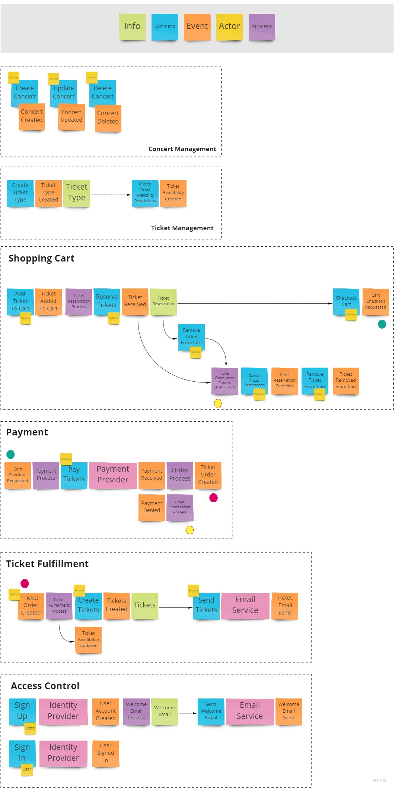

# Business Scenario and Analysis
## In a Nutshell...
### What is it?
**Overview of the system** 
Cloudbash is a concert management platform that will enable organizations to plan and sell tickets for concerts that are held at a physical location. The system will enable concert organizers to:
- Create concerts that are free to attend or optionally sell tickets for a set price.
- Manage guest lists and check ticket validity at the door.
Cloudbash will be a serverless application that can be easily deployed on Amazon Web Services by any organization.

| List of features                                      |
| :---------------------------------------------------- |
| Public website with programme and concert information |
| Online ticket sales                                   |
| Support for credit card payments                      |
| Attendee management                                   |
| Printable attendee list                               |
| Brandable – with custom logo and colors               |
| Administration dashboard                              |
| Sales metrics                                         |
| 3rd party integration (Facebook)                      |

### Who’s it for?
Any organization that organizes concerts (or other events) and wants to sell tickets. This can be small bars, big arenas or independent artists, holding concerts at various venues.

### Why build it?
Ticketing platforms like Eventbrite and Ticketmaster take a big cut of the sales (up to 15%). By using Cloudbash, ticket sellers can lower these costs significantly. The serverless application will scale up at busy times and scale down at slow hours- making sure you will never pay for unused servers.

### Similar products
* [Chumi](https://www.chumi.co/)
* [Eventbrite](https://www.eventbrite.com/)
* [Ticketmaster](https://www.ticketmaster.com/)
* [Attendize](http://www.attendize.com/)
* [CM](https://www.cm.com/)
* [PreTix](https://pretix.eu/)
* [Alf.io](https://alf.io/)

## Story Mapping
The story mapping results are best viewed on [Miro.com](https://miro.com/app/board/o9J_kthx_7g=/) or as an [image](https://bobvd.github.io/Cloudbash/assets/img/story_mapping.42249952.jpg).

## User Stories
### Actors

| Name           | Description                                                                                                            |
| :------------- | :--------------------------------------------------------------------------------------------------------------------- |
| **Organiser**  | A representative of an organization that is responsible for organizing concerts, the administrator of the application. |
| **Browser**    | User without an account- or that is not logged in.                                                                     |
| **Registrant** | Logged in user, looking for tickets to buy.                                                                            |
| **Attendee**   | A user that has bought a ticket for an event.                                                                          |

### Concerts
| Status | ID   | Description                                                                                                                                                                       |
| :--- | :--- | :-------------------------------------------------------------------------------------------------------------------------------------------------------------------------------- |
|  | CS01  | As an Organiser, I would like to create a concert, so I can start selling tickets.                                                                                                |
|  | CS02  | As an Organiser, I would like to remove a concert, so I can clean up the programme.                                                                                               |
|  | CS03  | As an Organiser, I would like to change a concert’s details, so I can make sure all information is correct.                                                                       |
|  | CS04  | As an Organiser, I would like to share my concert to social media, so I can promote it.                                                                                           |
|  | CS05  | As a Browser, I would like to view the Programme, so I can look for concerts that peek my interests.  <small>*The programme lists all the scheduled concerts by date.*</small> |
|  | CS06  | As a Browser, I would like to search for a concert by name, so I can quickly find the concert I am looking for.                                                                   |
|  | CS07  | As a Browser, I would like to filter concerts by genre, so I can find concerts of my liking.                                                                                      |
|  | CS08  | As a Browser, I would like to filter concerts by venue, so I can find concerts of my area.                                                                                        |

### Tickets
| Status | ID   | Description                                                                                                                                                                                                                                                              |
| :-------  | :--- | :----------------------------------------------------------------------------------------------------------------------------------------------------------------------------------------------------------------------------------------------------------------------- |
| | TS01  | As an Organiser, I would like to create tickets for my concert, so I can start selling.   <small> <i> An organizer can create one- or multiple types of tickets. Tickets can be paid or free. Limits can be set to the amount of available tickets. </i></small>      |
| | TS02  | As an Organiser, I would like to generate an PDF with QR code for each ticket sold.   <small> <i>A unique QR-code needs to be generated for each concert ticket. The PDF represents the physical ticket and will contain the QR-code and concert details.</i></small> |
| | TS03  | As an Organiser, I would like tickets to be emailed to their buyers.                                                                                                                                                                                                     |
| | TS04  | As an Organiser, I would like to offer credit card payments, so customers can easily buy tickets.                                                                                                                                                                        |
| | TS05  | As a Registrant, I would like to select tickets I want to buy, so I can attend an event.  <small> <i>Shoppers can buy up to 10 tickets for an event at the same time.</i></small>                                                                                     |
| | TS06  | As an Organiser, I would like tickets to be reserved when customers are ordering, so I can’t sell the same tickets twice.  <small><i>Tickets will be reserved for 15 minutes when selected by a customer.</i></small>                                                 |
| | TS07  | As an Organiser, I would like to have a chart showing the amount of tickets sold by day for a specific concert, so I can have insight in the sales numbers.                                                                                                              |
| | TS08  | As a Registrant, I would like to have an overview of my purchased tickets, so I can print them again when needed.                                                                                                                                                        |
### Attendee Management
| Status | ID   | Description                                                                                                                                                                                   |
| :--- | :--- | :-------------------------------------------------------------------------------------------------------------------------------------------------------------------------------------------- |
| | AM01 | As an Organiser, I would like to view a list of all attendees, so I can see who will attend my concert.                                                                                       |
| | AM02 | As an Organiser, I would like to check a ticket for its validity, so I can defend myself against ticket fraud.  <small>*The ticket’s QR-code can be checked for its authenticity.*</small> |
| | AM03 | As an Organiser, I would like to check-in attendees at the door of the venue, so I can know who is in the building.                                                                           |
| | AM04 | As an Organiser, I would like to print the attendee list, so I can have this list on hand at any time.                                                                                        |

### Administration
| Status | ID   | Description                                                                                                |
|:--- | :--- | :--------------------------------------------------------------------------------------------------------- |
| | AD01  | As an Organiser, I would like to create a venue, so that I can easily manage concerts that are held there. |
|  | AD02  | As an Organiser, I would like to disable user accounts, so that I can defend myself from fraud.            |

### Authentication
| Status | ID     | Description                                                                                                                 |
| :--- | :----- | :-------------------------------------------------------------------------------------------------------------------------- |
|  | AU01 | As a Browser, I would like to login with my e-mail and password, so I can authenticate myself.                              |
|  | AU02 | As a Browser, I would like to sign up for an account.                                                                       |
|  | AU03 | As a Registrant, I would like to sign out.                                                                                  |
|  | AU04 | As a Registrant, I would like to secure my account with Two-Factor Authentication, so that my account is safe from hackers. |
|  | AU05 | As an Organiser, I would like to send a welcome email after a new user registration, so that I can introduce the platform.  |

## Event Storming (WIP)
The Event Storming results are best viewed on [Miro.com](https://miro.com/app/board/o9J_kthgmqk=/) or as an c[image](https://bobvd.github.io/Cloudbash/assets/img/story_mapping.42249952.jpg).

More about Event Storming:
* [Introducing Event Storming by Alberto Brandolini](http://ziobrando.blogspot.com/2013/11/introducing-event-storming.html)
* [Awesome Event Storming on GitHub.com](https://github.com/mariuszgil/awesome-eventstorming)

## Bounded Contexts

## Class Diagrams
