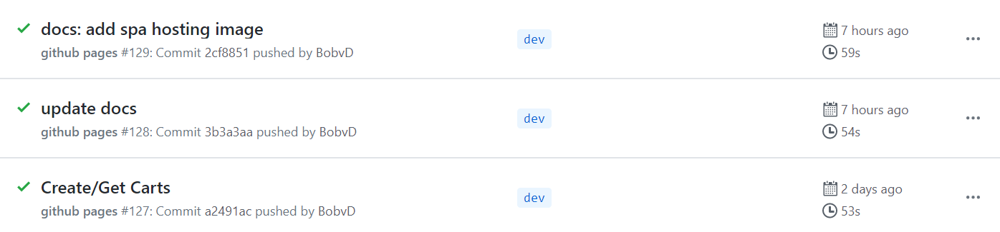

# Dev Ops
## Cloudbash CLI
## Serverless Framework
## AWS CodePipeLine
## Github Actions
Github Actions provide an easy way to automate software workflows. You can write actions yourself, but it is also possible to make use of actions written by other developers. Thousands of actions, able to be used for free, can be found on the [Github Marketplace](https://github.com/marketplace?type=actions).

Cloudbash makes use of Github Actions to build and deploy the documentation website to Github Pages, Github's free static web host. The action used is called [*actions-gh-page*s](https://github.com/peaceiris/actions-gh-pages) and was created by *peaceiris*.

Github actions are defined inside *workflows*, written in YAML files, and need to be placed in the *.github/workflows* folder at the root of the project. Actions can trigger after several different events; we have chosen to run this action after every push to the developer branch.

<<< @/../.github/workflows/build_docs.yml

<figure>
  
  <figcaption>A few examples of successful executions of the Github Workflow (containing our Action).</figcaption>
</figure>

## Load Testing