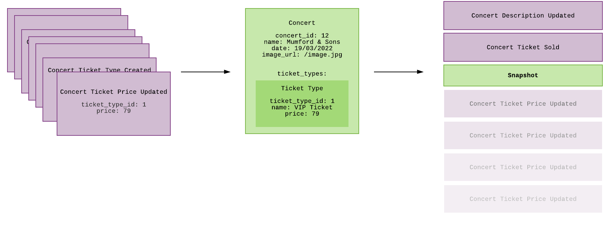
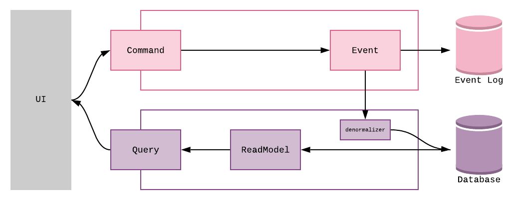

```
This article is written in dutch, a translated version will be posted soon™.
```
# Event Sourcing & CQRS

**Inhoud**
[[toc]]

## Introductie
Event-driven architecturen in het algemeen en event sourcing zijn de laatste jaren in populariteit toegenomen. Dit komt grotendeels door de opkomst van microservices en de behoefte voor het bouwen van schaalbare systemen die modulair en veerkrachtig zijn.

Event sourcing is een procedure die beschrijft hoe data op een specifieke manier opgeslagen kan worden. Wanneer event sourcing wordt gebruikt wordt niet de huidige staat van de data opgeslagen, maar alle gebeurtenissen die plaats hebben gevonden om tot deze staat te komen. 
<figure>
  
  <figcaption>Acties uitgevoerd in het systeem worden opgevangen in de vorm van events.</figcaption>
</figure>

We vangen deze gebeurtenissen op in de vorm van *events*, dit zijn simpele, [immutable﹖](#termonilogie) objecten die een uitgevoerde actie beschrijven.  

Events worden opgeslagen in het *Event Log*, dit is een [append-only﹖](#termonilogie) lijst met alle events die plaats hebben gevonden in het systeem. Het Event Log wordt beschouwd als de primaire databron van het systeem. De huidige staat van de applicatie is hier slechts een afgeleide van, we kunnen deze eenvoudig herbouwen door events uit het log, in chronologische volgorde, opnieuw af te spelen. 

<figure>
  
  <figcaption>Events worden chronologisch toegepast om tot de huidige staat van het object te komen.</figcaption>
</figure>

#### Business Constraints
Bij het uitvoeren van een operatie, is het vaak nodig om deze te valideren. Wanneer we een nieuw Concert willen inplannen, zal bijvoorbeeld eerst moeten worden gecontroleerd of de locatie wel beschikbaar is op de gewenste datum. Om achter de beschikbaarheid van de concert locatie te komen zullen we een subgroep events moeten afspelen. Het afspelen van deze events wordt ook wel *projecting* genoemd. Projecting is een in-memory proces waarbij een groep events wordt omgezet in een gestructureerde representatie. Het resultaat hiervan noemen we een *projection*, in dit geval heeft de projection de vorm van een concertprogramma. 

Hoewel dit proces op eerste gezicht langzaam lijkt, valt dit in de praktijk reuze mee. Het groepje events dat wordt afgespeeld is zo klein mogelijk, alleen de events relevant voor de projection worden opgevraagd. Meestal gebeurt dit in één database call. 

#### Snapshots
Om het groepje events dat voor iedere projection moet worden afgespeeld nog kleiner te maken, kunnen *snapshots* worden toegepast. Een snapshot geeft een overzicht van de staat op een bepaald moment in tijd. Wanneer we een groep events afspelen kunnen we dit doen vanaf een snapshot, hierdoor voorkomen we dat iedere keer alle events opnieuw afgespeeld moeten worden.

<figure>
  
  <figcaption>Snapshots</figcaption>
</figure>

## Waarom?
#### Limitaties van CRUD-systemen
-	Systemen gebasseerd op [CRUD-functies﹖](#termonilogie)  voeren operaties rechtsreeks op de databron uit, dit kan de performance van de applicatie verlagen.
-	Limiteert de schaalbaarheid. Lees- en schrijfacties kunnen niet eenvoudig en onafhankelijk van elkaar worden geschaald.
-	Tenzij er een aanvullende [auditing﹖](#termonilogie) functionaliteit wordt geïmplementeerd, die een aantekening van elke uitgevoerde operatie in een log bijhoudt. Gaat de historie van de applicatie verloren.
-	Hoe meer gebruikers, hoe groter de kans op data (concurrency) conflicten.

#### Voordelen van Event Sourcing

-	Auditing (Audit log): Elke aanpassing aan de data is vastgelegd. Betrouwbaar omdat het eventlog de primaire databron van het systeem is.
-	Historische staat: De opgeslagen events beschrijven niet alleen de huidige staat van de applicatie, maar ook hoe de applicatie tot dit punt is gekomen. Dit maakt het mogelijk de applicatie te herstellen naar een moment in het verleden.
-	Debugging: Speel de events uit de productie af naar een development omgeving. Zo vaak als nodig. We zijn niet meer hoofdzakelijk afhankelijk van logging.
-	Microservices: helpt bij het beheren van data op een schaalbare manier in gedistribueerde systemen.
-	Verschillende data schema's, CQRS: het scheiden van commands en queries maakt het mogelijk om verschillende query-systemen te hebben (met verschillende schema's).
-	Maakt het mogelijk de staat van de applicatie *in memory* te bewaren, wanneer het systeem opnieuw herstart wordt kan deze vanuit het eventlog herbouwd worden. Dit kan de performance van de applicatie verbeteren.
-	De data biedt mogelijkheden voor toekomstige nieuwe applicaties, functionaliteiten en rapportages.

## Aandachtspunten
Om event sourced systeem juist te kunnen ontwerpen en implementeren zal de ontwikkelaar zich een nieuwe manier van denken moeten aanmeten. Event Sourcing wordt vaak gebruikt in combinatie met Domain Driven Design, een ontwikkelaanpak waarbij de business en IT dichter bij elkaar worden gebracht. Het is algemeen bekend van deze aanpak dat deze een hoge leercurve heeft en relatief hoge kosten met zich meebrengt.

In een event sourced systeem worden grote hoeveelheden data, in verschillende vormen, op verschillende plaatsen bewaard. De verschillende in-memory processen, waaronder projecting, zorgen ervoor dat event sourced systemen meer geheugen gebruiken dan een vergelijkbaar CRUD- systeem. Dit brengt extra kosten met zich mee. Wel worden de kosten van hardware steeds lager.


## CQRS
In een traditioneel CRUD-systeem wordt dezelfde data gebruikt voor het schrijven en lezen. Het zou niet praktisch zijn voor een event-sourced systeem om bij iedere lees actie een projection uit te voeren. Vaak wordt event sourcing dan ook in combinatie met CQRS geïmplementeerd. 

CQRS zorgt voor een scheiding van de lees- en schrijfkant van een applicatie. Aan de schrijfkant worden commando’s uitgevoerd en aan de leeskant query’s afgehandeld. Door de strikte scheiding van deze zijdes kunnen datamodellen aan beide kanten worden aangepast aan de eisen van de command of query. 

Vaak worden er meer lees- dan schrijfacties uitgevoerd binnen een applicatie. Het gebruik van CQRS maakt het mogelijk om deze onderdelen onafhankelijk van elkaar te schalen. 


<figure>
  
  <figcaption>CQRS: Het scheiden van commands en queries.</figcaption>
</figure>

1.	Een actie wordt uitgevoerd door een gebruiker van de applicatie, op basis hiervan wordt een command gegenereerd. Het commando wordt opgevangen door een handler, deze voert de gewenste operatie uit. Op basis van deze uitgevoerde operatie wordt een event aangemaakt en opgeslagen in het event log.
2.	Events worden gepubliceerd op de event bus. Dit is een service bus die de schrijf en lees kant van het systeem met elkaar verbindt. 
3.	De denormalizer bouwt op basis van het event een readmodel en slaat deze op in de database.
4.	Wanneer een gebruiker van applicatie een query uitvoert wordt deze uitgevoerd op de read database. 

#### Eventual Consistency
Een systeem dat gebruik maakt van CQRS is altijd eventual consistent. Voordat de data aan de leeskant van het systeem up-to-date is, moeten ontvangen events eerst worden verwerkt. Het kan hierdoor voorkomen dat data op verschillende plaatsen binnen het systeem niet consistent is. Dit hoeft geen probleem te zijn, mits hier rekening mee wordt gehouden.


## Termonilogie

| Term            |  Beschrijving   |
| ---------------- | --- |
| **Immutable object** |   Aan het einde toegevoegd. Er kan geen data gewijzigd of verwijderd worden.  |
| **Append-only**       |  Onveranderbaar. Het object kan niet gewijzigd worden.       |
| **CRUD**| Create, Read, Update, Delete. De 4 basis functionaliteiten van een database. |
| **Auditing** | Het bijhouden van de activiteiten in een systeem. |
