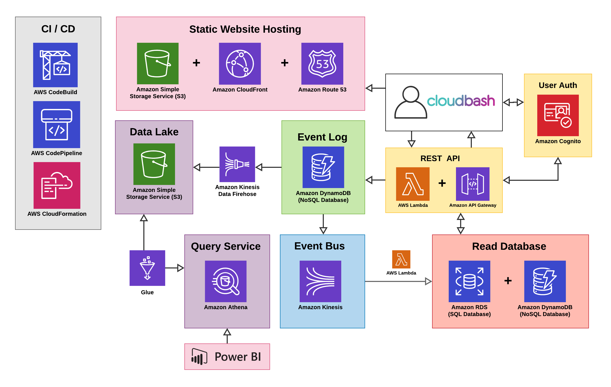
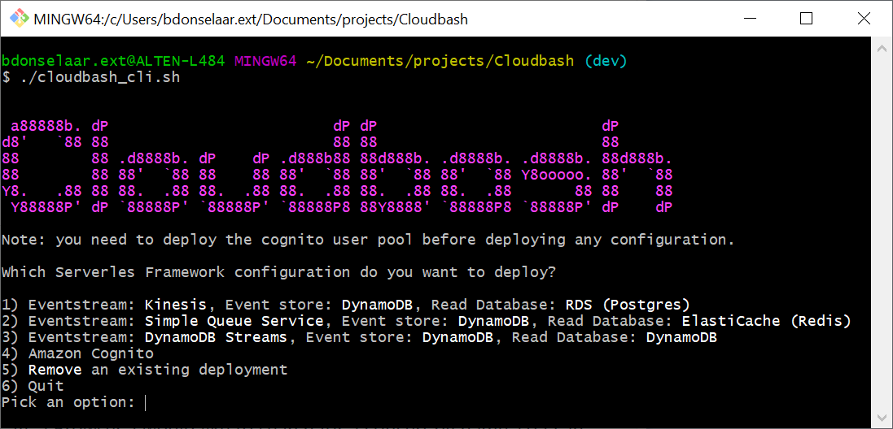

# Introduction

## About
Cloudbash is a web application demonstrating event sourcing (and other Domain Driven Design-patterns) in a serverless architecture on Amazon Web Services. The application is developed in ASP.NET Core and tries to follow the principles of Clean Architecture.

<figure>
  
  <figcaption>The Cloudbash Application.</figcaption>
</figure>

## Technical stack

### back end
- **[`.NET Core 3.x`](https://dotnet.microsoft.com/download)** 

### front end
- **[`Angular 8.x`](https://angular.io/)** - Single Page Application (SPA) framework
- **[`AWS Amplify`](https://aws.amazon.com/amplify/)** - Access Control with AWS Cognito

## Getting started
You can visit a live version of the application at [cloudbash.bobvd.dev](https://d2bgpsr44efzwn.cloudfront.net/) and use any of the credentials below.
```
          administrator       default user
username: admin@mail.com      user@mail.com
password: Password123,00      Password123,00
```
It is also possible to deploy your own instance of the application, you can use the [Cloudbash CLI](#cli).


## Cloudbash CLI <a name="cli"></a>
The Cloudbash CLI (Command Line Interface) is a small tool that will help you easily build and deploy the Cloudbash application to Amazon Web Services.

**Features**<br />
* Build & deploy Cloudbash configurations
* Remove existing deployments  
  
**Prerequisites**<br />
Before you can succesfully run the CLI, make sure you have:
1. Node.js v6 or higher installed.
2. .Net Core 3.1 SDK installed
3. Serverless Framework installed.
4. AWS Credentials are created and configured on your machine.
5. Downloaded the Cloudbash project from the GitHub page.
   
**Usage** <br />
Open your shell and navigate to the folder containing the Cloudbash project and run:
``` bash
$ ./cloudbash_cli.sh
```
The tool will start and ask you for the configuration you want to deploy.
<figure>
  
  <figcaption>The Cloudbash CLI.</figcaption>
</figure>
  
