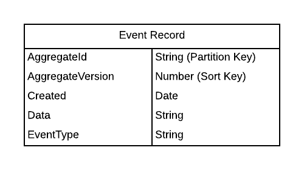
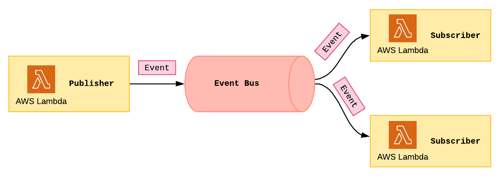
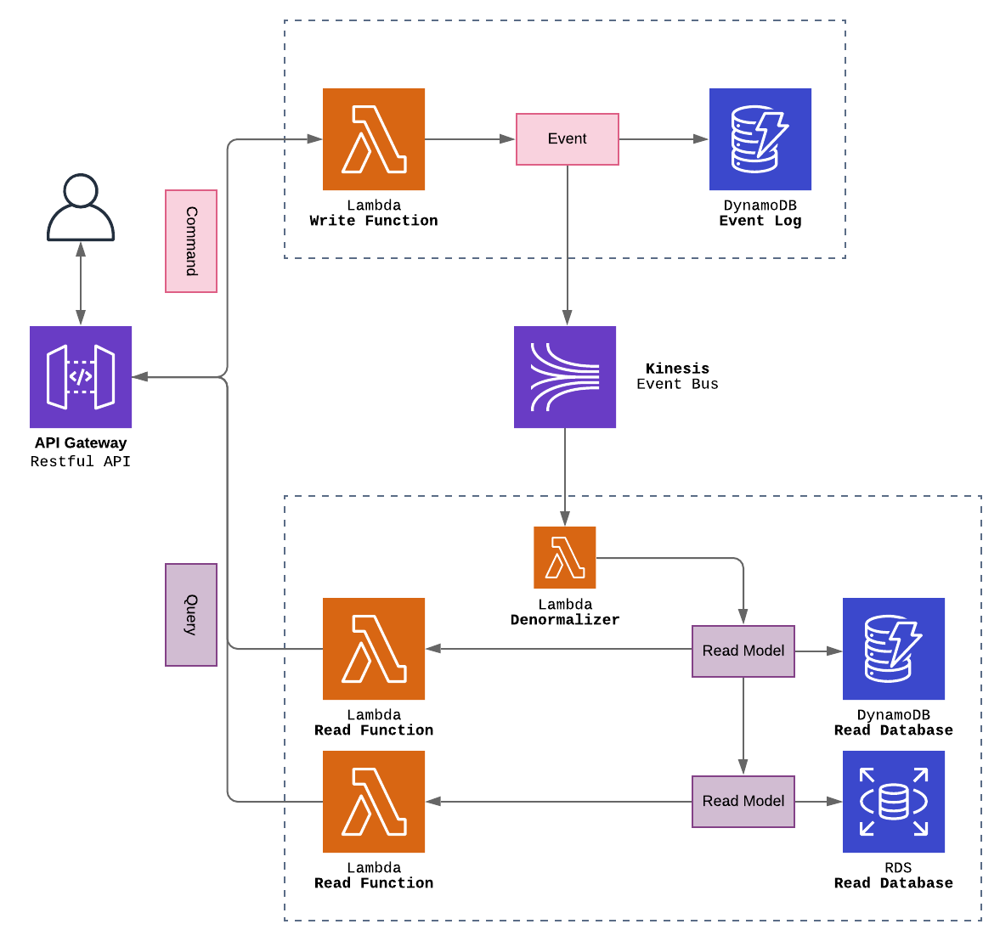

```
This article is written in dutch, a translated version will be posted soon™.
```
# Event-sourced Serverless Architecture

**Inhoud**
[[toc]]

## Introductie
Dit project demonstreert hoe een event-sourced applicatie kan worden opgezet binnen een serverless architectuur op Amazon Web Services (AWS). Bij een serverless architectuur wordt de software volledig gemanaged door de *Cloud provider*. De ontwikkelaar hoeft zich hierdoor minder zorgen te maken over de infrastructuur en kan zich focussen op het schrijven van code.

Serverless applicaties op AWS bestaan uit een combinatie van *Lambda*-functies en andere AWS-services. AWS Lambda is een compute dienst die code kan uitvoeren als reactie op een *event* ontvangen uit een andere AWS-service of bijvoorbeeld na een HTTP-request. 


## Waarom?
De veronderstelling is dat de voordelen die *event sourcing* kan bieden krachtig zijn in samenwerking met de voordelen van serverless architecturen.
  
- Schaalbaarheid, een combinatie van event sourcing en CQRS biedt een hoge vorm van schaalbaarheid. Door gebruikt te maken van AWS wordt het schalen van je applicatie uit handen genomen. Lambda functies kunnen uit zichzelf schalen (*auto scaling)*. Wanneer een instantie van een functie bezig is met het afwerken van een request, zal een tweede instantie vanzelf opstarten. Niet alleen Lambda functies zijn schaalbaar, ook andere services, onder meer databases en message queues, bieden hier ondersteuning voor.
- Lambda functies kunnen snel ontwikkeld worden, omdat er alleen code hoeft aangeleverd te worden. Er kan dus snel nieuwe functionaliteit worden ontwikkeld op basis van verzamelde events in het event log.
- Op basis van het event log kan een schat aan reportages gegenereerd worden. AWS heeft verschillende services die met deze data kunnen werken. Bijvoorbeeld om deze te visualiseren voor business analisten of om diverse varianten van machine learning uitvoeren.


## Architectuur
De  applicatie, kent de volgende architectuur, zoals eerder beschreven in [het artikel](event_sourcing/) over Event Sourcing en CQRS.

<figure>
  
  <figcaption></figcaption>
</figure>

Er kan met de applicatie, gecommuniceerd worden doormiddel van een *REST API*. De applicatie maakt gebruik van een *CQRS*, er is een schrijfkant kant die data wegschrijft naar het *Event Log* en een leeskant die data opvraagt uit een database. Communicatie tussen de verschillende onderdelen van de applicatie gebeurt via een *Message Bus*. 

De applicatie bestaat dus uit 4 belangrijke componenten waarvoor een serverless oplossing moest worden gevonden:
1. REST API
2. Event Log
3. Message Bus (Event Bus)
4. Lees Database
   

## RESTful API
Het REST API component van de applicatie is ontwikkeld met de volgende AWS-services: 

<figure>
  
  <figcaption></figcaption>
</figure>

### AWS Lambda
Zoals eerder beschreven is Lambda de Cloud compute service van Amazon Web Services. Voor ieder *endpoint* van de REST API is een Lambda-functie opgezet die de vereiste functionaliteit implementeert. Zie het artikel ['RESTful APIs with API Gateway & Lambda'](/aws_serverless/serverless_functions.md), voor een voorbeeld van de implementatie van een Lambda-functie in .NET Core. De [kosten van een Lambda](https://aws.amazon.com/lambda/pricing/) worden berekend aan de hand van het aantal requests in combinatie met het geheugengebruik en de duur van het draaien van de functie. Bij het 3 miljoen keer aanroepen van een functie die 512MB geheugen gebruikt en 1 seconde duurt zullen de kosten rond de $18.00 liggen.

### AWS API Gateway
API Gateway is een AWS-service voor het maken, monitoren en beveiligen van REST, HTTP en WebSockets APIs. 
De service maakt het mogelijk om Lambda-functies aan te roepen op basis van HTTP-requests. Voordat deze request wordt doorgezet kan er een vorm van autorisatie worden uitgevoerd, voor een voorbeeld hiervan zie het artikel ['Access Control with AWS Cognito'](/aws_serverless/cognito_auth.md). De [kosten van API Gateway](https://aws.amazon.com/api-gateway/pricing/) liggen rond de $1.00 per miljoen requests.


## Event Log - DynamoDB
Amazon DynamoDB is een NoSQL database die volledig beheerd wordt door Amazon Web Services. De database hoeft dus niet geïnstalleerd te worden, maar kan eenvoudig aangemaakt worden via de AWS Console of [Cloudformation](https://aws.amazon.com/cloudformation/).

#### Waarom DynamoDB gebruiken voor het event log?
* Doormiddel van IAM-permissies (Identity en Access Management) is het mogelijk te garanderen dat er alleen naar de database geschreven en gelezen kan worden. Omdat een event log append-only is willen we niet dat er records aangepast of verwijderd kunnen worden.
* De rangschikking van records kan worden gegarandeerd door gebruik te maken van een combinatie van *partition* (identifier) en *sort key* (versie).
* DynamoDB streams: een event stream waar met een Lambda-functie naar geluisterd kan worden. Na iedere gebeurtenis in de database wordt een event gegooid. Hier kan op worden ingespeeld, zo kunnen we bijvoorbeeld eenvoudig andere AWS-services aan de DynamoDB database koppelen.
* Er zijn geen limieten op de grootte van een tabel. Dit komt goed uit, want event logs kunnen snel groeien.
* De schrijf- en leesfunctionaliteit van de database kunnen los van elkaar en automatisch worden opgeschaald.
* Back-ups, DynamoDB heeft verschillende mogelijkheden voor het automatisch aanmaken van back ups. 

#### Aandachtspunten

* Items (records) die in de database worden opgeslagen kunnen maximaal 400KB groot zijn.
* De kosten van DynamoDB databases kunnen snel stijgen wanneer deze in grootte toenemen. Het is mogelijk om oude data, bijvoorbeeld, weg te schrijven naar S3 en hiermee kosten te verlagen.
  
### Dataschema 
<figure style="text-align:center;">
  
</figure>

| Attribuut        | Type          | Beschrijving                                                                                          |
|------------------|---------------|-------------------------------------------------------------------------------------------------------|
| AggregateId      | String (Guid) | *Partition key* <br /> ID van de Aggregate waar het event onder valt.                                   |
| AggregateVersion | Number        | *Sort Key* <br /> De versie van de aggregate – combinatie van AggregateId en AggregateVersion is uniek. |
| Created          | Date          | Datum en tijd van het aanmaken van het event.                                                         |
| Data             | String (JSON) | Geserialiseerde JSON-string met de gegevens van het event.                                            |
| EventType        | String        | De naam van het event.                                                                                |

**voorbeeld data**
``` json
{
"AggregateId" : "a8bab764-659b-4873-a8aa-618ed8b199bf",
"AggregateVersion": 3,
"Created": "2020-05-25T16:10:56.123Z",
"Data": "{\"CustomerId\":\"566316c4-ba88-4c0a-8c3a-0389792a1fe0\",\"EventId\":\"648c72e1-38f1-431b-8e73-91463ec876db\",\"AggregateId\":\"a8ea2d86-f091-4abe-895c-4a90f267882a\",\"AggregateVersion\":0}",
"EventType": "Cloudbash.Domain.Carts.Events.CartCreatedEvent",
}
```

## Event Bus
De Event bus verzorgt de communicatie tussen de verschillende componenten van de applicatie.

Een event bus kent één of meerdere *Publishers*, deze schrijven de events naar de bus, en één of meerder *Subscribers* (ook wel consumers genoemd), deze luisteren naar de bus en ontvangen berichten. We kunnen events vanuit een Lambda-functie naar de bus sturen en hier met andere Lambda-functies naar luisteren.

<figure style="text-align:center;">
  
</figure>


Amazon Web Services bied meerdere services die we kunnen gebruiken als Event Bus. Alle services zijn verschillend in prijs, performance en toepasbaarheid. Voor onze applicatie, Cloudbash, hebben we drie verschillende mogelijkheden onderzocht. 
### DynamoDB Streams
De eenvoudigste manier om een event bus te implementeren is door gebruik te maken van de stream mogelijkheden van het DynamoDB event log. Na ieder event record wat wordt weggeschreven naar dit log zal automatisch een notificatie worden verzonden via [DynamoDB streams](https://docs.aws.amazon.com/amazondynamodb/latest/developerguide/Streams.html). Er kan een Lambda worden geschreven die naar deze notificaties luistert.
#### Voordelen
* Eenvoudige oplossing, er zijn geen extra AWS-services nodig. Ook is het simpel om een Lambda aan deze stream te koppelen en events uit te lezen.
* De streams schalen, net zoals de DynamoDB database, vanzelf.
* Het luisteren met een Lambda naar een stream is gratis. 
#### Aandachtspunten
*	Er is een maximumaantal van twee subscribers. Voor kleine applicaties hoeft dit geen bezwaar te zijn, maar voor grotere applicaties die event-driven werken is dit niet voldoende.
*	De data in een stream is slechts voor 24 uur leesbaar.
*	Streams zijn gelimiteerd tot events die zijn uitgevoerd op de database tabel (CREATE, UPDATE, DELETE).
* Geen .NET Core library beschikbaar met een implementatie van de Objecten. Een definitie van de JSON-objecten moet zelf worden geïmplementeerd.


### Simple Message Service
[Amazon Simple Queue Service (SQS)](https://aws.amazon.com/sqs/pricing/) is een Message Queueing service die volledig beheerd wordt door Amazon Web Services. SQS biedt twee verschillende vormen van queues. De standaard queue biedt een maximale throughput (doorvoer) en zorgt ervoor dat elk bericht (minimaal) eenmaal wordt afgehandeld. FIFO-Queues (First-in-First-out) zijn specifiek ontworpen voor het eenmaal, op volgorde, afleveringen van berichten.

#### Voordelen
*	Implementatie van SQS zal herkenbaar zijn voor ontwikkelaars die eerder hebben gewerkt met een message broker zoals RabbitMQ of ActiveMQ.
*	Implementatie en integratie van SQS message queue’s is simpel. Er bestaan libraries in verscheidene talen (waaronder .NET Core) die het gebruik van de queue’s faciliteren, maar het is ook eenvoudig om zonder het gebruik van een library berichten naar een queue te sturen.
*	AWS Free tier biedt 1 miljoen SQS gratis per maand, iedere miljoen requests hierna kost rond de $0.40. Voor kleine applicaties kan SQS dus een goedkope optie zijn.
*	SQS schaalt automatisch, er is dus altijd voldoende capaciteit om je berichten te verwerken- en je betaalt nooit meer dan je verbruikt.
* FIFO-Queues kunnen de volgorde van bezorging garanderen. Zo zullen events als eerst verstuurt ook als eerste verwerkt worden, dit is erg belangrijk voor een juiste implementatie van event sourcing. 

#### Aandachtspunten
*	Wanneer een subscriber een bericht ontvangt uit de queue zal deze worden verwijderd. Het is dus niet mogelijk om hetzelfde bericht door meerdere subscribers te laten lezen. Als deze functionaliteit noodzakelijk is zal je het bericht naar verschillende queues moeten verzenden, ieder met zijn eigen subscriber.
*	Er is geen replay functionaliteit.

### Kinesis Data streams
[Kinesis Data Streams](https://aws.amazon.com/kinesis/data-streams/) is een Amazon Web Service ontwikkelt voor het schaalbaar en real-time streamen van grote hoeveelheden data. 

Een Kinesis data stream bestaat uit een set van *shards*, iedere *shard* heeft zijn eigen geordende lijst met *data records*. Records in deze lijst krijgen een volgnummer toegewezen door Kinesis. Hierdoor kunnen we records altijd op de juiste volgorde uitlezen, maar is het hiervoor wel noodzakelijk dat records met hetzelfde *AggregateId* naar dezelfde shard worden weggeschreven. Nadat records zijn toegevoegd aan een shard kunnen zij standaard voor 24 uur worden uitgelezen, maar het is mogelijk om dit (tegen extra kosten) te verlangen tot maximaal 7 dagen.

#### Voordelen
*	Kinesis is specifiek ontwikkelt voor het real-time verzenden en verwerken van data.
*	Het op volgorde afspelen van berichten uit dezelfde shard werkt foutloos.
*	Kinesis is een *stream*, geen *queue* (wachtrij) zoals SQS. Wanneer berichten zijn ontvangen door een consumer worden zij niet gelijk verwijderd. Hierdoor kunnen berichten ook opnieuw worden afgespeeld (*replay*) en afgehandeld door consumers.  
*	Iedere stream kan tot 20 consumers hebben, 
*	Berichten hebben een maximale grootte van 1MB.
*	Hoewel SQS goedkoop is voor applicaties met een kleiner volume, kunnen kosten snel stijgen wanneer dit volume toeneemt. Kinesis is juist het meest prijs effectief bij grootte hoeveelheden berichten. 
*	[Kinesis Data Analytics](https://aws.amazon.com/kinesis/data-analytics/) biedt een eenvoudig oplossing voor het query-en op streaminggegevens met standaard SQL.
*	De *Kinesis Client Library* maakt het gemakkelijk om applicaties te bouwen die werken met Kinesis Data Streams.

#### Aandachtspunten
*	Kinesis is schaalbaar doormiddel van shards. Er kunnen maximaal 1000 berichten per shard, per seconde worden weggeschreven. Het is mogelijk om honderden shard te reserveren, zodat er altijd voldoende capaciteit is. Maar hiervoor moet wel betaald worden, er moet dus een juiste afweging voor worden gemaakt. 

### Welke AWS-Service is het meest geschikt als Event Bus?
Ieder van de drie beschreven AWS-services zou een geschikte oplossing kunnen zijn als Event Bus. Dit ligt voornamelijk aan het type applicatie- en de bijbehorende eisen die deze heeft opgesteld voor de event bus. Cloudbash, de reference applicatie behorende bij dit artikel, is een applicatie die functionaliteiten omvat voor het verkopen van grootte getallen concert tickets. Het systeem werkt op basis van een event-driven architectuur waarbij grootte hoeveelheden berichten aan meerdere consumers moeten worden afgeleverd. Er is daarom gekozen gebruik te maken van **Kinesis Data streams**. Deze service heeft als enige ondersteuning voor meerdere consumers. Ook maakt de persistence en replay functie van Kinesis het eenvoudig om berichten opnieuw af te spelen. 

## Read Database
Een van de voordelen van een systeem dat gebruik maakt van CQRS, is dat data op een manier kan worden opgeslagen in een vorm die precies is aangepast op de eisen van de lezer. Dit artikel zal niet diep ingaan op de voordelen van een NoSQL- of SQL-database, of wanneer je een van beide zou moeten toepassen. Het biedt slechts een overzicht van de verschillende managed database services die AWS aanbiedt.

### DynamoDB
Zoals eerder beschreven is [DynamoDB](https://aws.amazon.com/dynamodb/) een (key-value document) NoSQL database, ontwikkeld door Amazon, die aangeboden wordt in de vorm van een managed service.

#### Voordelen
*	Flexibiliteit, zoals de meeste NoSQL databases is DynamoDB schema loos. Data kan in allerlei vormen worden opgeslagen- en hoeven niet aan een eerder vastgelegd schema voldoen. Dit kan een goede combinatie zijn voor event sourced systemen waarbij functionaliteiten snel kunnen veranderen.
*	Werken met de DynamoDB SDK (onder meer beschikbaar voor .NET Core) is eenvoudig. Het verbinden met een database, wegschrijven en lezen van data kan geïmplementeerd worden met slechts enkele regels code.
*	DynamoDB is een van de belangrijkste AWS-services en heeft een goede integratie met andere services zoals AWS- [CloudSearch](https://aws.amazon.com/cloudsearch/), [EMR](https://aws.amazon.com/emr/) of [Data Pipeline](https://aws.amazon.com/datapipeline/).
*	De grootte van een tabel heeft geen limiet.
*	Goede performance, *lees-requests* kunnen worden afgehandeld in enkele milliseconde. Capaciteit tot wel 20 miljoen requests per seconde.
*	[DynamoDB Accelerator (DAX)](https://aws.amazon.com/dynamodb/dax/) is een in-memory cache service voor DynamoDB die de performance tot wel 10x kan versnellen- de tijd die nodig is om lees-requests af te handelen kan verlaagd worden tot microsecondes.

#### Aandachtspunten
* NoSQL-databases zijn niet de juiste database voor het uitvoeren van complexe query’s op relationele data. 
*	Omdat records opgeslagen in DynamoDB maximaal 400kb groot kunnen zijn, is de database niet geschikt voor het opslaan van binaire objecten, zoals afbeeldingen of documenten.

### Relational Database Service 
[Amazon Relational Database Service (RDS)](https://aws.amazon.com/rds/) maakt het gemakkelijk om verschillende type SQL-databases op te zetten, gebruiken en beheren.

RDS ondersteund, op het moment van schrijven, 6 verschillende database engines; Amazon Aurora, PostgresSQL, MySQL, MariaDB, Oracle, en Microsoft SQL Service.

#### Voordelen

*	Werkt in samenwerking met ORM-frameworks zoals Entity Framework Core (.NET Core) of Hibernate (Java).
*	Schaalbaar. Door bijvoorbeeld gebruik te maken van *Read Replicas *kan lees-verkeer naar de primaire database worden verspreid over verschillende instanties. Amazon Aurora zal automatisch in grootte groeien wanneer nodig. De grootte van de overige database kunnen handmatig worden geschaald zonder downtime.
*	Geautomatiseerde back-ups. Hoewel dit niet belangrijk is voor een event-sourced systeem, waarbij we de database altijd opnieuw kunnen genereren op basis van het event log.
*	RDS biedt ondersteuning voor alle grote database engines. Deze brengen wel hun eigen specificatie en limieten met zich mee.
*	Mogelijk om de database te isoleren in een *Virtual (Private) Network* en verbinding te maken met een *VPS*.

#### Aandachtspunten
* Je betaalt een vast bedrag voor iedere database instantie die is aangemaakt. Het is mogelijk om een instantie voor 1-3 jaar te reserveren en hiermee kosten te besparen.

### ElastiCache
De laatste jaren zijn de hardware kosten van geheugen gigantisch gedaald. Het wordt hierdoor economisch interessanter om databases in het geheugen te bewaren. Event-sourced applicaties werken erg goed in combinatie met *in-memoy databases*. Bij een herstart van het systeem zal de database, in het geheugen, verloren gaan, maar doormiddel van event-sourcing kunnen we deze altijd herbouwen door de events opnieuw af te spelen.

### Welke AWS-Service is het meest geschikt als *Read Database*?
Het type read database moet worden geselecteerd op basis van de eisen van de betreffende functionaliteit. Voor de Cloudbash applicatie wordt gebruik gemaakt van vershillende type database engines, die het best passen bij de eisen van de functionaliteit. De applicatie biedt bijvoorbeeld gebruikers de mogelijkheid om programma met concerten te filteren op naam, locatie en datum. Deze informatie zal opgeslagen worden in een RDS (PostgresSQL) database, vanwege de geschiktheid voor het uitvoeren van query’s op relationele data. Functionaliteiten zoals winkelwagentjes, waarbij we data, zonder relaties, willen opslaan 

## Conclusie

In dit artikel hebben we verschillende AWS-services, die we zouden kunnen toepassen voor de vier belangrijke componenten van een Event-sourced applicatie, beschreven en vergeleken. 

Definitieve keuze:
* *Restful API* – API Gateway en Lambda
* *Event Log* – DynamoDB
* *Event Bus* – Kinesis
* *Read Databases* – DynamoDB en RDS (PostgreSQL)

<figure>
  
  <figcaption>CQRS & Events sourcing op Amazon Web Services</figcaption>
</figure>