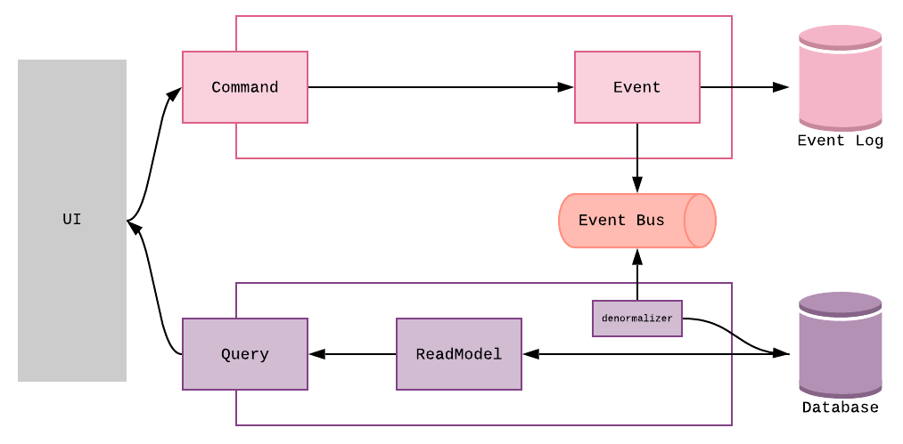
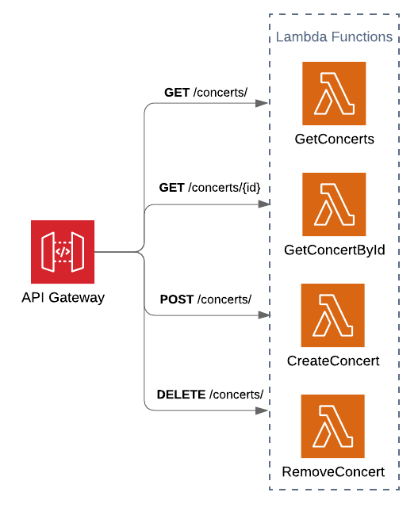

```
This article is written in dutch, a translated version will be posted soon™.
```
# Event-sourced Serverless Architecture

**Inhoud**
[[toc]]

## Introductie
Dit project demonstreert hoe een event-sourced applicatie kan worden opgezet binnen een serverless architectuur op Amazon Web Services (AWS). Bij een serverless architectuur wordt de software volledig gemanaged door de *Cloud provider*. De ontwikkelaar hoeft zich hierdoor minder zorgen te maken over de infrastructuur en kan zich focussen op het schrijven van code.

Serverless applicaties op AWS bestaan uit een combinatie van *Lambda*-functies en andere AWS-services. AWS Lambda is een compute dienst die code kan uitvoeren als reactie op een *event* ontvangen uit een andere AWS-service of bijvoorbeeld na een HTTP-request. 


## Waarom?
De veronderstelling is dat de voordelen die *event sourcing* kan bieden krachtig zijn in samenwerking met de voordelen van serverless architecturen.
  
- Schaalbaarheid, een combinatie van event sourcing en CQRS biedt een hoge vorm van schaalbaarheid. Door gebruikt te maken van AWS wordt het schalen van je applicatie uit handen genomen. Lambda functies kunnen uit zichzelf schalen (*auto scaling)*. Wanneer een instantie van een functie bezig is met het afwerken van een request, zal een tweede instantie vanzelf opstarten. Niet alleen Lambda functies zijn schaalbaar, ook andere services, onder meer databases en message queues, bieden hier ondersteuning voor.
- Lambda functies kunnen snel ontwikkeld worden, omdat er alleen code hoeft aangeleverd te worden. Er kan dus snel nieuwe functionaliteit worden ontwikkeld op basis van verzamelde events in het event log.
- Op basis van het event log kan een schat aan reportages gegenereerd worden. AWS heeft verschillende services die met deze data kunnen werken. Bijvoorbeeld om deze te visualiseren voor business analisten of om diverse varianten van machine learning uitvoeren.


## Architectuur
De  applicatie, kent de volgende architectuur, zoals eerder beschreven in [het artikel](event_sourcing/) over Event Sourcing en CQRS.

<figure>
  
  <figcaption></figcaption>
</figure>

Er kan met de applicatie, gecommuniceerd worden doormiddel van een *REST API*. De applicatie maakt gebruik van een *CQRS*, er is een schrijfkant kant die data wegschrijft naar het *Event Log* en een leeskant die data opvraagt uit een database. Communicatie tussen de verschillende onderdelen van de applicatie gebeurt via een *Message Bus*. 

De applicatie bestaat dus uit 4 belangrijke componenten waarvoor een serverless oplossing moest worden gevonden:
1. REST API
2. Event Log
3. Message Bus (Event Bus)
4. Lees Database
   

## RESTful API
Het REST API component van de applicatie is ontwikkeld met de volgende AWS-services: 

<figure>
  
  <figcaption></figcaption>
</figure>

### AWS Lambda
Zoals eerder beschreven is Lambda de Cloud compute service van Amazon Web Services. Voor ieder *endpoint* van de REST API is een Lambda-functie opgezet die de vereiste functionaliteit implementeert. Zie het artikel ['RESTful APIs with API Gateway & Lambda'](/aws_serverless/serverless_functions.md), voor een voorbeeld van de implementatie van een Lambda-functie in .NET Core. De [kosten van een Lambda](https://aws.amazon.com/lambda/pricing/) worden berekend aan de hand van het aantal requests in combinatie met het geheugengebruik en de duur van het draaien van de functie. Bij het 3 miljoen keer aanroepen van een functie die 512MB geheugen gebruikt en 1 seconde duurt zullen de kosten rond de $18.00 liggen.

### AWS API Gateway
API Gateway is een AWS-service voor het maken, monitoren en beveiligen van REST, HTTP en WebSockets APIs. 
De service maakt het mogelijk om Lambda-functies aan te roepen op basis van HTTP-requests. Voordat deze request wordt doorgezet kan er een vorm van autorisatie worden uitgevoerd, voor een voorbeeld hiervan zie het artikel ['Access Control with AWS Cognito'](/aws_serverless/cognito_auth.md). De [kosten van API Gateway](https://aws.amazon.com/api-gateway/pricing/) liggen rond de $1.00 per miljoen requests.


## Event Log
### DynamoDB

#### Waarom DynamoDB als event log?
* Doormiddel van IAM-permissies (Identity en Access Management) is het mogelijk te garanderen dat er alleen naar de database geschreven en gelezen kan worden. Omdat een event log append-only is willen we niet dat er records aangepast of verwijderd kunnen worden.
* De rangschikking van records kan worden gegarandeerd door gebruik te maken van een combinatie van partition (id) en sort key (versie).
* DynamoDB streams: een event stream waar met een Lambda-functie naar geluisterd kan worden. Na iedere gebeurtenis in de database wordt een event gegooid. Hier kan op worden ingespeeld, zo kunnen we bijvoorbeeld eenvoudig andere AWS-services aan de DynamoDB database koppelen.
* Er zijn geen limieten op de grootte van een tabel. Dit komt goed uit, want event logs kunnen snel groeien.
* De schrijf- en leesfunctionaliteit van de database kunnen los van elkaar en automatisch worden opgeschaald.
* backups

#### Aandachtspunten

* Items (records) die in de database worden opgeslagen kunnen maximaal 400KB groot zijn.
  
### Event record 
``` json
{
"AggregateId" : "aa139dd8-e87c-4105-bfd9-d7240f4c9a33",
"AggregateVersion": 1,
"Created": 1590492880,
"EventType": "ConcertUpdated",
"Data": "{}"
}
```

## Event Bus

### DynamoDB Streams
### Simple Message Service
### Kinesis 


## Read Database

### DynamoDB
### ElastiCache
### Relation Database Service (RDS)